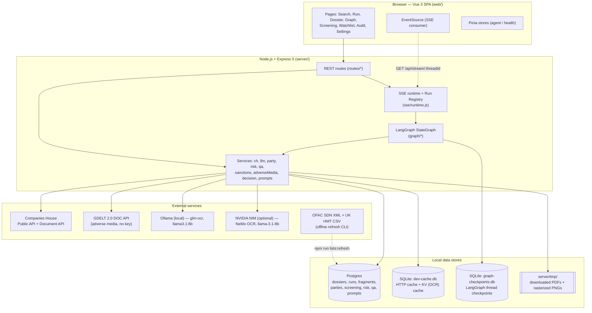
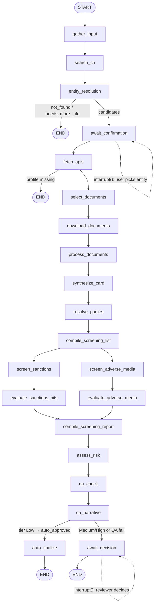
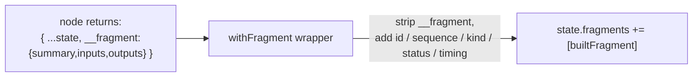
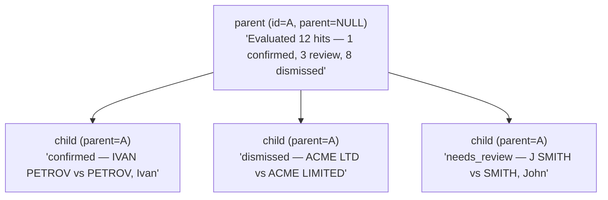
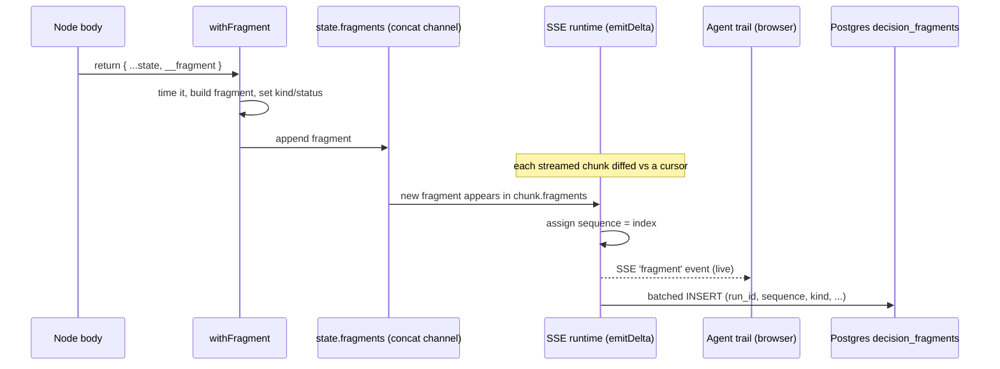
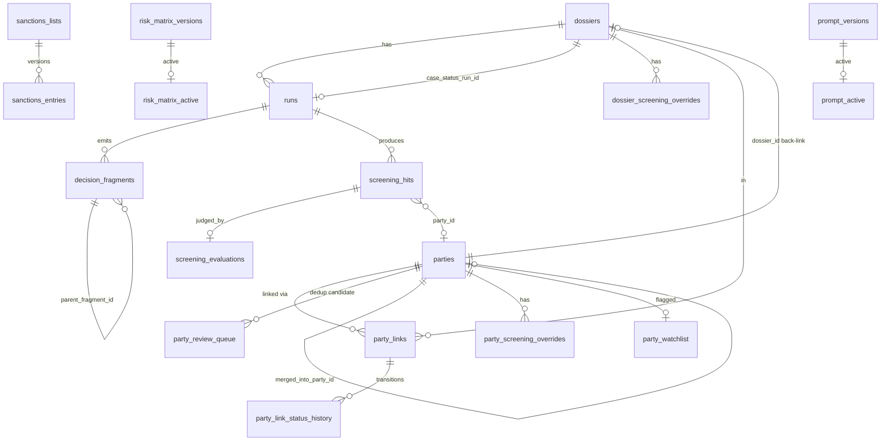
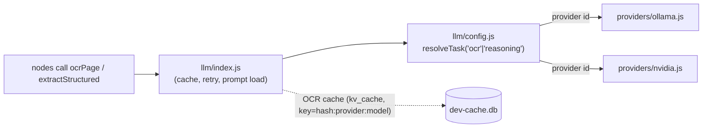
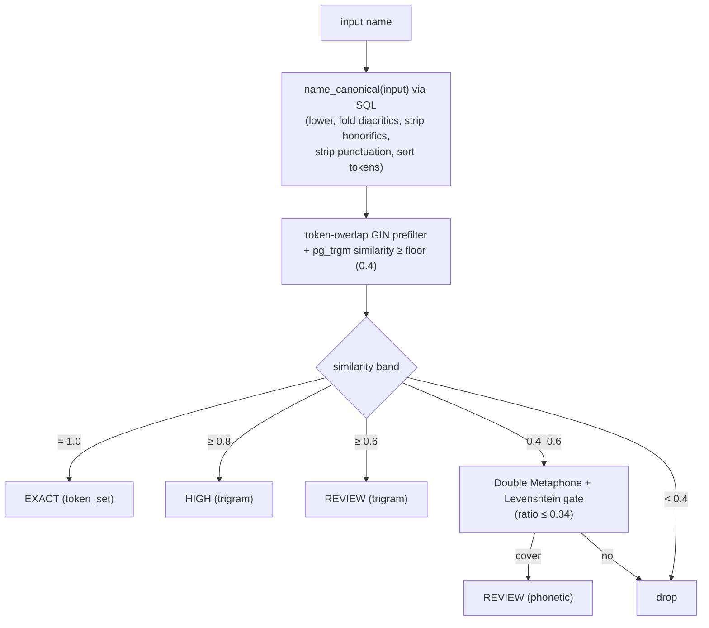
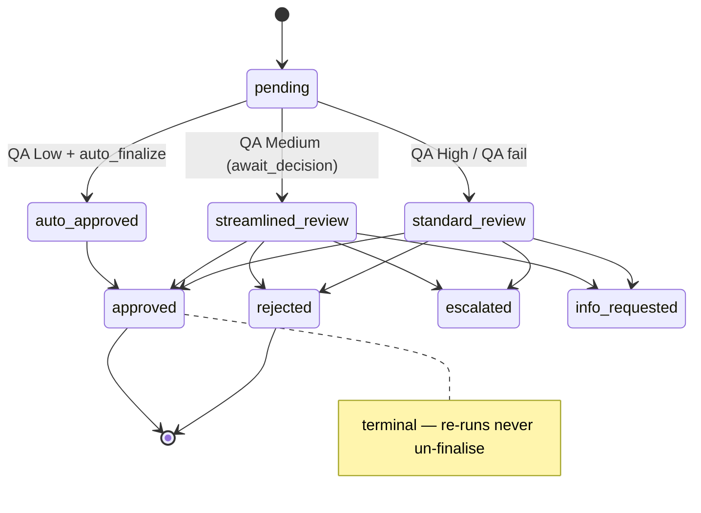

# Technical Architecture — UK Company KYC POC

**Status:** As-built technical reference, prepared for solution-architect review.
**Scope of this document:** Whole-system architecture with a deep focus on the **server** (the agentic pipeline, data model, integrations, and engines). The Vue frontend is described at the boundary only.
**Audience:** Technical solution architect + engineering. Assumes familiarity with Node.js, Postgres, and LLM application patterns.

> **How this doc relates to the others.** This repo already has good companion docs — read them alongside this one rather than expecting this to repeat them:
> - [`BUSINESS_PROCESS.md`](BUSINESS_PROCESS.md) — the case lifecycle in business language (actors, phases, governance).
> - [`SCREENING_PLAN.md`](SCREENING_PLAN.md) — the locked-in screening design.
> - [`IMPLEMENTATION.md`](IMPLEMENTATION.md) — the phase-by-phase build tracker (Screening / Risk / LLM provider / QA).
> - [`CODE_REVIEW.md`](CODE_REVIEW.md) — a prior code review with P0/P1 findings.
> - [`P0_IMPLEMENTATION_PLAN.md`](P0_IMPLEMENTATION_PLAN.md) / [`P1_IMPLEMENTATION_PLAN.md`](P1_IMPLEMENTATION_PLAN.md) — build-ready plans for the §16 P0 / P1 backlog (R0–R3 / R4–R7).
> - [`CLAUDE.md`](CLAUDE.md) — the agent-facing repo guide (quick-reference; this doc is the authoritative system view).
>
> This document is the *system view that ties them together* and the *consolidated improvement backlog* (§16).

---

## 0. Documentation reconciliation (R0 — done)

**R0 is complete.** `CLAUDE.md` and this document have been reconciled: `CLAUDE.md` is the **agent quick-reference**, this document is the **authoritative system view**, and the two no longer contradict each other. `CLAUDE.md` now documents the Party Master, the pluggable LLM backend, the second (`await_decision`) interrupt, the QA narrative step, and the R1 authentication tier. The drift items previously listed here (party master, Ollama↔NVIDIA provider abstraction, `resolve_parties`/`qa_narrative`/`await_decision`/`auto_finalize` nodes, in-graph human decision) are all now covered in both docs.

Live facts to keep in lock-step when either doc changes:

| Fact | Current value |
|---|---|
| SQL migrations | `0000`–`0021` (22 migrations; party master 0012–0019, users 0020–0021) |
| Graph nodes | 21 (15 top-level in `graph/nodes/*` + 6 screening in `graph/nodes/screening/*`) |
| Compiled graphs | 2 (full + screening-only, both ending at `assess_risk`→QA→decision) |
| Auth | Real (R1): app-owned `users`, Postgres-backed sessions, roles analyst/reviewer/admin; `x-user-id` only behind `AUTH_DEV_BYPASS` |

The P0/P1 backlog build plans (`P0_IMPLEMENTATION_PLAN.md`, `P1_IMPLEMENTATION_PLAN.md`) track §16 item status; consult them before reopening a backlog item here.

---

## 1. What the system does (one paragraph)

A single analyst searches Companies House by name or number, confirms the right entity, and an agent then: fetches the registry API surface + recent filings, runs OCR / structured extraction over the PDFs, synthesizes a **KYC dossier** (identity, officers, PSC, shareholders, financials, red flags) and a Cytoscape ownership graph, **resolves every party into a cross-dossier master record**, **screens** every subject (company + officers + PSCs + shareholders) against locally-cached sanctions lists (OFAC SDN, UK HMT) and live adverse-media (GDELT news), runs a **deterministic weighted-factor risk assessment**, a **QA gate** that routes the case, generates a regulator-style **narrative**, and then either auto-approves (low risk) or pauses for a **human reviewer decision**. Every step is persisted as immutable decision fragments so a reviewer can audit and override.

It is explicitly a **POC**: single tenant, runs locally, no production observability, no Docker. Authentication is real as of R1 (app-owned users + server-side sessions + roles) and durable run execution is implemented as of R2 (pg-boss queue + worker + `run_events` transport, flag-gated by `RUN_EXECUTION`); the remaining gap to production is multi-tenancy and observability.

---

## 2. System context



### 2.1 Technology stack

| Layer | Choice | Notes |
|---|---|---|
| Frontend | Vue 3 (Composition API), Vite, Vue Router, Pinia, Cytoscape.js + `cytoscape-dagre` | SPA, proxies `/api` → `:3000` |
| Backend | Node.js (CommonJS), Express 5 | Single process |
| Orchestration | `@langchain/langgraph` 1.x `StateGraph` + `@langchain/langgraph-checkpoint-sqlite` | One graph, one human-in-the-loop interrupt (now two) |
| LLM | `@langchain/ollama` + `@langchain/openai` (for NIM) behind a provider abstraction | `glm-ocr` (vision OCR), `llama3.1:8b` (reasoning), `withStructuredOutput` for JSON |
| PDF | `pdf-parse` (text), `pdf-to-png-converter` (rasterize), `@napi-rs/canvas` | Pure-JS, zero native deps for raster |
| Primary DB | Postgres via `pg` + `drizzle-orm`, migrations via `drizzle-kit` | Native install (no Docker) |
| Caches | `better-sqlite3` (HTTP + OCR KV cache); SQLite checkpointer | Two separate `.db` files |
| Name matching | `fastest-levenshtein`, `double-metaphone`, Postgres `pg_trgm` + `fuzzystrmatch` | Trigram GIN index + phonetic fallback |
| Sanctions parse | `fast-xml-parser` (OFAC), `papaparse` (HMT) | |

### 2.2 Deployment topology (current)

Everything runs on one developer workstation: Express on `127.0.0.1:3000`, Vite dev server on `:5173`, Postgres native, Ollama on `:11434`, two SQLite files + a `tmp/` directory on local disk. There is **no container, no process manager, no reverse proxy**. An **auth tier now exists** (R1: app-owned users, Postgres-backed sessions, role guards) and **durable run execution exists** (R2: optional pg-boss worker process + `run_events` SSE transport, off by default via `RUN_EXECUTION=inline`). The remaining production gaps are multi-tenancy and observability (see §16.1).

---

## 3. The agentic pipeline (LangGraph)

The heart of the system is a single `StateGraph` defined in [`server/graph/build.js`](server/graph/build.js). State is a Zod schema ([`server/graph/state.js`](server/graph/state.js)) that is **the contract between every node** — nodes return only the partial keys they update, and array channels (`trace`, `errors`, `fragments`, `screeningHits`, `screeningEvaluations`, `partyLinks`...) use a concat reducer so parallel branches merge cleanly.

### 3.1 Full graph (initial run / refresh)



Five logical phases share the graph:

1. **Entity resolution + API fetch.** Search CH, deterministically score candidates, pause (`interrupt()`) for the user pick, then pull profile / officers / PSC / filing-history in parallel (`Promise.allSettled`).
2. **Document pipeline.** Pick the latest filing per target category (`confirmation-statement`, `accounts`, `incorporation`; hard cap 3), download to `server/tmp/<cn>/<txn>.pdf`, try text extraction first, OCR with the vision model if the extractor's `ocrPolicy` says so, then run a category-specific structured-extraction prompt.
3. **Party resolution + screening.** Resolve subjects into the party master, compile the subject list, run two parallel branches (sanctions vs cached lists, adverse media via GDELT on individuals only), have the reasoning LLM evaluate each potential hit, and assemble a `screeningReport` with a deterministic risk rule.
4. **Risk assessment.** Deterministic weighted-factor score + LLM rationale, with screening-driven knockouts.
5. **QA + decision.** Pure QA engine routes the case; an LLM narrative is generated; the case either auto-finalizes or pauses for a human decision.

### 3.2 Screening-only graph (rescreen)

A second compiled graph (`compiledScreeningOnlyGraph`) starts at `resolve_parties` and is **seeded** by the rescreen route with `profile / officers / psc / kycCard / documents` from the prior run. It skips Companies House, document download, OCR, and synthesis — but still re-runs the resolver (so cross-dossier dedup happens on every touch), screening, risk, QA, narrative, and decision routing. This is the same node set, wired START→`resolve_parties`.

### 3.3 Node responsibilities (server-grounded)

| Node | File | Pure? | LLM? | Key behaviour |
|---|---|---|---|---|
| `gather_input` | `nodes/gatherInput.js` | ✅ | — | Normalises name / number / postcode (regex-validated) / year |
| `search_ch` | `nodes/searchCh.js` | — | — | CH search (20) or direct profile-by-number; maps hits to candidates |
| `entity_resolution` | `nodes/entityResolution.js` | ✅ | — | Deterministic scoring (base + number/postcode/year/type bonuses); `auto_match` if top ≥0.85 and ≥0.20 ahead, else `needs_user_pick` |
| `await_confirmation` | `nodes/awaitConfirmation.js` | — | — | **`interrupt()`** #1; validates the chosen company number is in the candidate set |
| `fetch_apis` | `nodes/fetchApis.js` | — | — | Parallel profile/officers/psc/filings; **partial-failure now marked failed** (was silently green) |
| `select_documents` | `nodes/selectDocuments.js` | ✅ | — | Latest filing per category, cap 3 |
| `download_documents` | `nodes/downloadDocuments.js` | — | — | Parallel download to tmp; partial download marked failed |
| `process_documents` | `nodes/processDocuments.js` | — | ✅ OCR + extract | Text-first, OCR if policy; **OCR capped at 5 pages**, raster scale 1.5; one child fragment per doc |
| `synthesize_card` | `nodes/synthesizeCard.js` | — | ✅ | Merges API + docs into the KYC card; **API-authoritative override** after the LLM; builds Cytoscape graph; surfaces failed docs as red flags |
| `resolve_parties` | `nodes/resolveParties.js` | — | — | Calls the party resolver; rewrites the shareholder graph to `party:<uuid>` IDs and collapses duplicate person nodes |
| `compile_screening_list` | `nodes/screening/compileScreeningList.js` | ✅ | — | Party-keyed subjects (or legacy fallback); company + officers + PSCs + extracted shareholders |
| `screen_sanctions` | `nodes/screening/screenSanctions.js` | — | — | Fuzzy match each subject × {OFAC, HMT}; emits hit rows |
| `evaluate_sanctions_hits` | `nodes/screening/evaluateSanctionsHits.js` | — | ✅ | Per-hit LLM judgement; per-hit isolation; party/dossier overrides applied |
| `screen_adverse_media` | `nodes/screening/screenAdverseMedia.js` | — | — | GDELT search on **individuals only**, serial 6s spacing |
| `evaluate_adverse_media` | `nodes/screening/evaluateAdverseMedia.js` | — | ✅ | Per-article LLM relevance/category/severity; overrides short-circuit the LLM |
| `compile_screening_report` | `nodes/screening/compileScreeningReport.js` | ✅ | — | Deterministic report + overall-risk rule (shared `services/screening/report.js`) |
| `assess_risk` | `nodes/assessRisk.js` | — | ✅ rationale | Weighted-factor engine + knockouts + trajectory; LLM rationale w/ template fallback |
| `qa_check` | `nodes/qaCheck.js` | ✅ | — | Completeness + consistency + tier-based routing |
| `qa_narrative` | `nodes/qaNarrative.js` | — | ✅ | Regulator-style narrative; **hard-fail (no template fallback)** |
| `await_decision` | `nodes/awaitDecision.js` | — | — | **`interrupt()`** #2; apply-then-resume; short-circuits on already-finalised dossiers |
| `auto_finalize` | `nodes/autoFinalize.js` | — | — | Low-risk auto-approval via `applyDecision` with `system` user |

A few cross-cutting observations from reading the nodes:

- **Prompt-injection defence is deliberate and real.** `synthesizeCard.overrideFromApi` re-asserts identity / officers / PSC from the CH API *after* the LLM runs, so a poisoned PDF can't rewrite an officer name or company number. `evaluate_adverse_media`'s prompt explicitly tells the model the article fields are untrusted. This is a notable strength.
- **"Never throw out of a node"** is enforced by `withFragment` (catches everything except `GraphInterrupt`, converts to a `failed` fragment + `state.errors` entry). `qa_narrative` is the one intentional exception (hard-fail → run closes `failed`).
- **Config propagation is fragile.** Several nodes (`resolve_parties`, `auto_finalize`) re-derive `dossierId`/`runId` from the DB by `thread_id` because LangGraph snapshots `configurable` at stream start and mid-stream mutations (the lazy dossier/run upsert) don't propagate. This works but is a smell (see §16.4).

### 3.4 State schema as the contract

[`state.js`](server/graph/state.js) defines ~25 channels. The discipline worth noting:

- **Single-writer channels** (`riskAssessment`, `qaResult`, `qaNarrative`, `screeningReport`, `kycCard`) have no reducer — last write wins, and only one node writes them.
- **Concat-reducer channels** (`trace`, `errors`, `fragments`, `screeningHits`, `screeningEvaluations`, `parties`, `partyLinks`) accumulate across nodes and across the two parallel screening branches without a join barrier.
- The screening sub-schemas (`SubjectSchema`, `HitSchema`, `EvaluationSchema`) carry an optional `partyId` — the bridge between the per-run logical subject id and the stable cross-run party identity.

---

## 4. Decision fragments, SSE, and run lifecycle

### 4.1 The fragment model

A **decision fragment** is one durable, human-readable record of *"a step happened, here's what it decided, here's the evidence, here's how long it took."* It is the unit of the audit trail. The system's core promise — that a reviewer or regulator can replay every decision the agent made and see why — is kept by fragments: every node emits one (or several), they stream live to the UI (`AgentTrail.vue` is just a rendering of the fragment list), and they are written immutably to Postgres.

#### Schema

`decision_fragments` ([`db/schema.js`](server/db/schema.js)):

```sql
CREATE TABLE decision_fragments (
  id                  uuid PRIMARY KEY DEFAULT gen_random_uuid(),
  run_id              uuid NOT NULL REFERENCES runs(id) ON DELETE CASCADE,
  parent_fragment_id  uuid REFERENCES decision_fragments(id) ON DELETE SET NULL, -- self-FK
  node_id             text NOT NULL,         -- 'fetch_apis', 'evaluate_sanctions_hits', ...
  sequence            integer NOT NULL,      -- ordering within the run (0,1,2,...)
  kind                fragment_kind NOT NULL,    -- 'decision' | 'audit' | 'human_action'
  status              fragment_status NOT NULL,  -- 'ok' | 'failed' | 'skipped'
  started_at          timestamptz NOT NULL DEFAULT now(),
  duration_ms         integer,
  summary             text,                  -- one-line human sentence
  inputs              jsonb,                 -- what the node saw
  outputs             jsonb,                 -- what the node produced
  error               text                   -- populated when status='failed'
);
```

Three columns carry the design:
- **`parent_fragment_id`** — a *self*-FK that builds the parent/child tree (below).
- **`ON DELETE SET NULL`** on it — deleting a parent never cascade-deletes its children; they survive with a null parent. (Contrast `run_id`, which is `ON DELETE CASCADE`.) For a KYC trail, *"the per-hit sanctions reasoning silently disappeared"* would be unacceptable; this rule prevents it.
- **`kind`** — UI emphasis + audit weight (below).

#### How `withFragment` produces them

Every node is wrapped once by `withFragment(nodeId, fn)` ([`graph/fragments.js`](server/graph/fragments.js)) so no node hand-rolls timing, error capture, or state-append. A node returns its normal partial state **plus** a magic `__fragment` key:

```js
const fetchApis = withFragment('fetch_apis', async function fetchApis(state, config) {
  // ... do work ...
  return {
    profile, officers, psc, filingHistory,          // normal state updates
    __fragment: {                                    // the magic key
      summary: 'Fetched 4 Companies House endpoints in 820ms — 3 officers, 1 PSC, 47 filings',
      inputs:  { companyNumber },
      outputs: { ms: 820, officers: 3, psc: 1, filings: 47 },
    },
  };
});
```

The wrapper then: records `startedAt`/`durationMs`, runs the body in a `try/catch`, **strips** `__fragment` out of the state, builds a full fragment object (filling `id`/`sequence`/`kind`/`status`), and **appends** it to the `state.fragments` concat-reducer channel.



The wrapper is also what makes the **"never throw out of a node"** rule work: a thrown error is caught → converted to a `status:'failed'` fragment + a `state.errors` entry (the run keeps going, the trail shows a red step). The one exception is `GraphInterrupt` (from `interrupt()`), which is re-thrown so LangGraph can pause. A plural form `__fragments: [...]` lets one node emit many fragments in a single pass (used by `process_documents` — one per PDF — and the evaluators).

#### The three `kind` values

Classified by `kindOf()` against a static `DECISION_NODES` set:

| kind | Meaning | Examples | Writer |
|---|---|---|---|
| **`decision`** | A judgement a reviewer cares about | `entity_resolution`, `synthesize_card`, `evaluate_*`, `assess_risk`, `qa_check` | graph node (in the set) |
| **`audit`** | Mechanical/plumbing step, no judgement | `gather_input`, `search_ch`, `fetch_apis`, `download_documents` | graph node (not in the set) |
| **`human_action`** | A human took a terminal action | reviewer approve / reject / escalate | `applyDecision`, **outside the graph** |

`human_action` is the only kind written out-of-band: `applyDecision` computes `sequence = max(existing)+1` and inserts the fragment inside the same DB transaction that flips `case_status` — because it's a human decision *after* the graph finished, not a streamed graph step.

#### Parent/child nesting (the `evaluate_*` case)

Most nodes emit one fragment. The two evaluators loop over many potential hits and ask the LLM to judge each, so a flat "evaluated 12 hits" would hide the per-hit reasoning a reviewer must see. They emit a **tree**: one parent (`parent_fragment_id = NULL`) plus one child per hit (`parent_fragment_id = <parent id>`). The parent id is generated up-front and threaded into each child ([`evaluateSanctionsHits.js`](server/graph/nodes/screening/evaluateSanctionsHits.js)); the node returns `__fragments: [parent, ...children]`.



The UI collapses children under the parent (virtualised past ~50).

#### Lifecycle: node → screen → database



`sequence` is assigned at persistence time as the fragment's index in the run's growing list ([`sse/runtime.js`](server/sse/runtime.js)) — the stable replay ordering. Fragments emitted *before* the dossier/run row exists (early nodes) are buffered in memory and flushed in a batch once `companyNumber` first appears.

#### A concrete slice of one run

| sequence | node_id | kind | status | parent | summary |
|---|---|---|---|---|---|
| 0 | gather_input | audit | ok | — | Captured user input: name "Acme Trading Ltd" |
| 1 | search_ch | audit | ok | — | CH search returned 7 candidates |
| 2 | entity_resolution | decision | ok | — | Top match Acme Trading Ltd (09988776) at 0.91 — auto-match |
| 3 | await_confirmation | decision | ok | — | User confirmed Acme Trading Ltd (09988776) |
| 4 | fetch_apis | audit | ok | — | Fetched 4 endpoints in 820ms — 3 officers, 1 PSC |
| 7 | process_documents | decision | ok | — | Processed confirmation-statement via OCR — 4 shareholders |
| 11 | evaluate_sanctions_hits | decision | ok | — | Evaluated 3 hits — 0 confirmed, 1 review, 2 dismissed |
| 12 | evaluate_sanctions_hits | decision | ok | **#11** | needs_review — J SMITH vs SMITH, John (OFAC SDN) |
| 13 | evaluate_sanctions_hits | decision | ok | **#11** | dismissed — ACME LTD vs ACME LIMITED (UK HMT) |
| 18 | assess_risk | decision | ok | — | Risk assessment — Medium (score 42, tier Medium) |
| 19 | qa_check | decision | ok | — | QA passed; risk tier Medium → streamlined review |
| 21 | human_decision | **human_action** | ok | — | User jbillay approved case |

Rows 12–13 hang off row 11. Row 21 is written via `applyDecision` (its own DB transaction, `sequence = max+1`) — **outside** the normal `withFragment` → `state.fragments` → SSE → DB path every other row uses. The graph still *manages* the human step (the `await_decision` interrupt suspends and resumes the run); only the fragment *write* is out-of-band.

#### Why the human decision is written out-of-band (not by the resuming node)

It would be tidier for `await_decision` to emit its fragment via `withFragment` on resume. It deliberately doesn't, for three reasons — all of which make the audit *more* robust:

1. **Atomicity.** The decision must flip `dossiers.case_status` **and** write the audit record as one unit. `applyDecision` does both in a single Postgres transaction. If the fragment were instead written on graph resume, a finalised case could end up with no audit record when the resume fails (and the resume is the unreliable link — see §16.4). Binding the audit record to the status flip, not to the resume, is the safer choice.
2. **`sequence` collision.** Graph fragments get `sequence` = their index in `state.fragments` (assigned by the SSE runtime); `applyDecision` runs *before* the resume and uses `sequence = max(sequence)+1`. A fragment emitted by the resuming node would land on a contradictory sequence for the same run, breaking replay ordering. So the node skips `withFragment`.
3. **Different actor.** `human_action` records that a *human* acted — the actor is the **verified session user** (`req.auth.userId`, derived from the R1 server-side session, never a client-supplied header) — a categorically different record (`kind='human_action'`, `node_id='human_decision'`, decision payload). The `/api/fragments/:id` middleware refuses any non-GET against it to keep it immutable.

The same `applyDecision` path is used by the `auto_finalize` graph node on the Low-risk auto-approve route (actor = `system`) — so a `human_action` fragment *can* be triggered from inside graph execution; the distinction is the **write path** (`applyDecision` vs `withFragment`), not graph-vs-not-graph. The cost of this design is the apply-then-resume seam called out in §16.4.

### 4.2 SSE runtime + run registry

[`server/sse/runtime.js`](server/sse/runtime.js) owns all in-memory thread state via a `RunRegistry` class (no module-level mutable maps). Responsibilities:

- **Buffer + fan out** SSE events (`progress`, `trace`, `error`, `fragment`, `interrupt`, `cancelled`, `done`, plus screening-specific `screening_subject_started`, `screening_hit`, `screening_hit_evaluated`). Buffer is capped at 2000 events per thread (backpressure: oldest drop).
- **Lazy persistence.** Dossier + run rows are created on the first chunk that carries `companyNumber`; fragments emitted before that are buffered and flushed in a batch.
- **Write-through.** `emitDelta` diffs each streamed chunk against per-thread cursors (`lastTraceLen`, `lastFragmentLen`, `lastScreeningHitLen`, ...) and persists only the new tail — fragments (batched), screening hits, screening evaluations, the QA result, and the QA narrative.
- **Lifecycle / GC.** Threads are GC'd 5 min after terminus (to allow SSE reconnect replay); a hard-reaper kills threads running >2 h; stale `running` runs left by a crashed process are reaped on boot (`repo.reapStaleRuns`, 120 min).
- **Run closure.** At a clean terminus, `closeRun` freezes the final snapshots onto the `runs` row (`final_kyc_card`, `final_screening_report`, `final_risk_assessment`, `final_profile/officers/psc`, `qa_result`, `qa_narrative`).

```mermaid
sequenceDiagram
    participant UI
    participant REST as routes/runs.js
    participant RT as sse/runtime (runGraph)
    participant G as compiledGraph
    participant DB as Postgres

    UI->>REST: POST /api/run {name|number}
    REST->>RT: runGraph(threadId, input, {graph})
    RT->>G: graph.stream(input, streamMode:values)
    loop each state chunk
        G-->>RT: chunk (partial state)
        RT->>RT: emitDelta → diff cursors
        RT->>DB: lazy create dossier+run; batch fragments / hits / evals
        RT-->>UI: SSE trace/fragment/screening_* events
    end
    G-->>RT: interrupt (await_confirmation)
    RT-->>UI: SSE interrupt {candidates}
    UI->>REST: POST /api/resume/:threadId {companyNumber}
    REST->>RT: runGraph(threadId, Command{resume})
    Note over G,RT: ... screening / risk / qa ...
    G-->>RT: interrupt (await_decision)
    RT-->>UI: SSE interrupt {kind:final_decision, runId, qaResult}
    UI->>REST: POST /api/dossiers/:cn/runs/:id/decision
    REST->>DB: applyDecision (txn: flip case_status + human_action fragment)
    REST->>RT: runGraph(threadId, Command{resume:{decisionApplied}})
    G-->>RT: END → closeRun (freeze snapshots)
    RT-->>UI: SSE done {caseStatus}
```

### 4.3 Two interrupts, two resume contracts

- **`await_confirmation`** → SSE `interrupt {kind:'entity_selection'}`; resumed by `POST /api/resume/:threadId {companyNumber}`.
- **`await_decision`** → SSE `interrupt {kind:'final_decision', runId, qaResult, kycCard...}`; the `/decision` endpoint **applies the decision transactionally first** (flips `dossiers.case_status` + writes the immutable `human_action` fragment), *then* resumes the graph with `Command({resume:{decisionApplied:true,...}})`. The node deliberately does **not** write a fragment on resume (the `human_action` row is canonical; an in-graph fragment would collide on `sequence`).

This apply-then-resume design is clean but couples the REST handler, the decision service, and the graph resume into one logical transaction-across-systems (Postgres txn + LangGraph checkpoint). Worth a hard look for failure-atomicity (see §16.4). **As of R2, in `RUN_EXECUTION=queue` mode the resume is a durable pg-boss `run.resume` job** rather than a fire-and-forget `setImmediate` — so a web restart between `applyDecision` and the resume no longer strands the run, which closes the P1 R4b atomicity gap for the queue path.

---

## 5. Data architecture

### 5.1 Three datastores, by purpose

| Store | File / engine | Holds | Rationale |
|---|---|---|---|
| **Postgres** | native | Dossiers, runs, fragments, prompts, sanctions lists/entries, screening hits/evals, overrides, risk matrix, **party master (8 tables)**, QA results | Relational audit system of record |
| **SQLite #1** | `dev-cache.db` (`better-sqlite3`) | `http_cache` (CH responses keyed by URL) + `kv_cache` (OCR results by file hash; country normalisation; adverse-media by name+ISO-week) | Cheap local cache; makes CH rate limits a non-issue |
| **SQLite #2** | `graph-checkpoints.db` (`SqliteSaver`) | One row per thread step; used to resume after `interrupt()` | LangGraph checkpointer |
| **Filesystem** | `server/tmp/<cn>/` | Downloaded PDFs + rasterized PNGs | OCR input; reaped after 30 days |

### 5.2 Postgres schema (entity-relationship)



Key modelling decisions (from [`db/schema.js`](server/db/schema.js)):

- **Append-only audit discipline.** `decision_fragments` and `party_link_status_history` are never updated after insert. The `/api/fragments/:id` middleware refuses any non-GET against a `human_action` row.
- **Case lifecycle as an enum FSM.** `case_status ∈ {pending → auto_approved | streamlined_review | standard_review → approved | rejected | escalated | info_requested}`. The producing run is back-linked via `case_status_run_id` (`ON DELETE SET NULL`).
- **`parties.name_canonical` is a Postgres `GENERATED ALWAYS … STORED` column** computed by a SQL `name_canonical()` function (migration 0012). A **JS twin** (`services/party/canonical.js`) must stay in lock-step — this is a documented, deliberate duplication, and a fragility point.
- **`party_type` is text + CHECK, not an enum** — intentional, so future `trust`/`partnership` values don't need an `ALTER TYPE`.
- **Versioned, singleton-active config** is a repeated pattern: `prompt_versions/prompt_active`, `risk_matrix_versions/risk_matrix_active`. Append-only, never edit in place.
- **`screening_config`** is a single-row table (`id=1`) holding the match threshold + adverse-media results-per-subject.

### 5.3 Migrations

22 SQL migrations (`0000`–`0021`) under `db/migrations`, applied by `npm run db:migrate`. The trajectory is legible: init → cancelled status → prompts → screening → screening config/severity → rescreen → run API state → risk matrix → QA + decisions → P0 hardening → QA narrative → **party master (0012–0019: matcher, token index, linkage, hits.party_id, overrides, merge audit, watchlist)** → **users + auth (0020–0021: `users`/`user_role`, `users.email`)**. The party master and the R1 auth tier are the most recent areas of growth.

---

## 6. External integrations

### 6.1 Companies House ([`services/ch.js`](server/services/ch.js))

Two APIs, one key (HTTP Basic, key as username, blank password): the public API (search / profile / officers / PSC / filing-history) and the Document API (filing PDFs, presigned-S3 redirect). Notable hardening already present:

- **SSRF allowlist** on redirect-follow (`beforeRedirect` checks the host against a pinned set including the observed S3 buckets).
- **Input validation** — company number / transaction id / document id regexes; path-containment checks so a download can't escape `tmp/`.
- **Secret redaction** in error messages (`redactSecrets` strips the API key from any leaked URL/body).
- **Caching** via SQLite `http_cache`; `forceFresh` bypasses for the refresh flow. CH's 600 req / 5 min limit is a non-issue locally because of the cache.

### 6.2 Adverse media — GDELT ([`services/adverseMedia/gdelt.js`](server/services/adverseMedia/gdelt.js))

Free, no API key. Queries `mode=ArtList&format=json` for `"<name>" AND (risk-term OR group)` over a rolling window (default 12m). Important constraints baked in:

- **Headlines only** — no snippet; the evaluation prompt knows this.
- **Strict serial semaphore** (1 concurrent, 6 s min spacing) + two 429 retries + two network retries. Persistent 429 → soft-skip (`GDELT_RATE_LIMITED`, not a hard error).
- Cached by `name + ISO-week` (7-day implicit TTL).
- **Individuals only** in v1 (companies too noisy without disambiguation).

This is the single biggest **throughput bottleneck** in the pipeline: N individuals × ≥6 s serial = the dominant wall-clock cost on dossiers with many officers/PSCs (see §16.2).

### 6.3 Sanctions lists ([`services/sanctions/*`](server/services/sanctions))

Loaded into Postgres (`sanctions_lists`, `sanctions_entries`) by an **offline CLI** (`npm run lists:refresh`). v1 ships OFAC SDN enhanced XML + UK HMT consolidated CSV. Adding a source = a parser under `sources/` + `parsers/`. **Must be run once after `db:migrate`** or sanctions screening returns zero hits. Matching is local: token-set ratio + Double Metaphone fallback against name + every alias, single global threshold (default 0.85).

### 6.4 LLM provider abstraction ([`services/llm/*`](server/services/llm))

A clean, recently-added abstraction that the rest of the codebase imports via a stable surface (`ocrPage`, `extractStructured`, `checkProviders`):



- **Per-task provider selection**, env-driven: `LLM_OCR_PROVIDER` / `LLM_REASONING_PROVIDER` → `LLM_PROVIDER` → default `ollama`. An unset `.env` behaves exactly as Ollama-for-both.
- **The OCR cache key now includes provider+model** so switching backends doesn't serve stale cross-model OCR.
- **One retry** on structured-extraction failure, prepending the `extract.json_strict_retry` prompt. No deeper retry/backoff.
- `extractStructured` → `ChatOllama({format:'json'}).withStructuredOutput(zodSchema)` (Ollama) or the NIM equivalent (`structuredMethod`, default `functionCalling`).

Known Ollama gotcha preserved: `glm-ocr` needs `num_ctx: 16384` or it crashes on full-page images.

---

## 7. The AI / LLM pipeline in detail

There are **seven LLM touchpoints**, all routed through the prompt registry ([`services/prompts.js`](server/services/prompts.js)) — no hard-coded prompts elsewhere:

| Prompt key | Where | Output | Failure mode |
|---|---|---|---|
| `ocr.page` | `process_documents` | Markdown page text | per-page isolated; 0/all pages → doc failed |
| `extract.confirmation_statement` | `process_documents` | shareholders[] | doc failed |
| `extract.accounts` | `process_documents` | headline financials | doc failed |
| `extract.incorporation` | `process_documents` | initial subscribers | doc failed |
| `kyc.synthesis` | `synthesize_card` | KYC card (then API-overridden) | node failed |
| `screening.evaluate_sanctions_hit` | `evaluate_sanctions_hits` | confirmed/dismissed/needs_review + score | per-hit isolated |
| `screening.evaluate_adverse_media` | `evaluate_adverse_media` | decision + category + severity | per-hit isolated |
| `risk.rationale` | `assess_risk` | headline + drivers + sanctionsNote | falls back to deterministic template |
| `risk.normalize_country` | risk engine | ISO-2 or null | cached; only on static-lookup miss |
| `qa.narrative` | `qa_narrative` | N-paragraph memo | **hard fail** (run closes failed) |

Prompt-engineering quality is genuinely good: the sanctions prompt biases to `needs_review` when identifiers are absent and forbids "confirmed" on name-alone; the adverse-media prompt has explicit untrusted-input framing and knows snippets are empty; the rationale/narrative prompts forbid inventing facts and force agreement with the deterministic engine. **Where the LLM is allowed to decide vs where it is overridden is a clear, defensible boundary** — the API is authoritative for identity, the engine is authoritative for score/tier/routing, and the LLM only judges (per-hit) or narrates.

The structural-extraction reliability story is the weakest link (single model, single retry, no confidence scoring, no eval harness) — see §16.3.

---

## 8. Entity resolution & the Party Master

This is the most architecturally significant subsystem and the least documented elsewhere. It does two distinct jobs:

1. **Per-run entity *confirmation*** (which Companies House company is this?) — the deterministic scorer in `entity_resolution` (§3.3).
2. **Cross-run, cross-dossier party *identity*** (is this "John Smith" the same human we've seen on three other dossiers?) — the Party Master.

### 8.1 The matcher waterfall ([`services/party/matcher.js`](server/services/party/matcher.js))

A 4-layer name resolution with **one SQL round trip** + an in-code phonetic pass:



Performance is carefully engineered: a `name_tokens && string_to_array($1,' ')` GIN overlap prefilter so a no-match input returns in ~1 ms instead of a full trigram bitmap scan, and the canonicalisation is isolated into its own cheap query so the planner binds a literal. This is production-grade thinking for a POC.

### 8.2 The resolver ([`services/party/resolver.js`](server/services/party/resolver.js))

Called by `resolve_parties` for every subject (officers → PSCs → shareholders, in that order so PSCs/shareholders can dedup against just-created officer parties). Per subject:

- **Layer 0 — strong key first.** Individual officer → CH appointment id (`/officers/<ID>/appointments`); corporate → `(country, registration_number)`. A hit auto-links at confidence 1.0, no review item.
- **Else name matcher.** `EXACT` (sim 1.0) → auto-link (name-only EXACT is treated as authoritative *for the POC* — see §16.5, this is a real KYC risk). `HIGH`/`REVIEW` → create a **new** party **and** enqueue `party_review_queue` items for a human. No candidates → silent new party.
- **Link upsert** is idempotent on `(party_id, dossier_id, role, appointed_on, notified_on)`; status reflects the latest CH observation (`active`/`resigned`/`ceased`).
- **Status history** appended on transitions.
- **Match log** written for *every* matcher call (even zero-match) — replay-grade audit.
- **Historical reconciliation:** any link on this dossier the current run didn't touch is flipped to `historical` (that's how "this officer disappeared from the latest snapshot" is captured without destroying history).
- **Corporate back-link:** a corporate party with a UK registration number that matches an onboarded dossier gets `parties.dossier_id` set → enables cross-dossier graph traversal.

**Idempotency is the stated invariant** — re-running against the same inputs yields the same parties + links; against changed inputs, precisely the diff.

### 8.3 Merge, review queue, watchlist, cross-dossier graph

- `party_review_queue` holds pending dedup decisions; `POST /api/parties/review-queue/:id/resolve` merges or rejects.
- **Soft-merge** (`services/party/merge.js`, `POST /api/parties/:id/merge`): `:id` is the winner; the loser gets `merged_into_party_id` + merge-audit columns. Idempotent.
- **Watchlist** (`party_watchlist`): reviewer-flagged parties tracked across dossiers; membership is the whole feature (no alerting in the POC).
- **Cross-dossier ownership graph** (`services/party/graph.js`, `GET /api/parties/:id/graph?depth=`): Cytoscape-shaped traversal centred on a party.

### 8.4 The graph-rewrite subtlety

After resolving, `resolve_parties` rewrites the shareholder graph from `synthesize_card` to `party:<uuid>` node IDs and **collapses** (a) honorific-bearing duplicates ("Mr Vincent Huard" vs the party "vincent huard") via the shared canonicaliser, and (b) partial-name individuals onto their full-name twin ("Vincent Huard" ← "Vincent Matthieu Benjamin Huard") via a strict-subset token test — **at the display layer only**, never merging the underlying party rows. This is the fix recorded in the project memory ([graph-dedup-canonical](.../memory/graph-dedup-canonical.md)).

---

## 9. Screening subsystem

Already well-covered by [`SCREENING_PLAN.md`](SCREENING_PLAN.md); the architecturally salient points:

- **Subjects** = company ∪ officers ∪ PSCs ∪ extracted shareholders, party-keyed when the resolver ran (`subjectId = party:<uuid>`), legacy `${source}:${normalizedName}` otherwise.
- **Two parallel branches** join at `compile_screening_report` via concat reducers — no explicit barrier needed.
- **Override precedence:** party-level override (cross-dossier) wins over dossier-level override. For sanctions the LLM still runs (audit trail) but the override decides; for adverse media the override short-circuits the LLM entirely (articles churn weekly).
- **Deterministic overall-risk rule** (`services/screening/report.js`, no LLM): confirmed sanctions → `high`; serious confirmed adverse media or sanctions `needs_review` → `medium`; else `low`. This single value feeds the risk knockouts.
- **Latest-only** — no historical re-screen-as-of-date; every run uses the current `sanctions_entries`.

---

## 10. Risk assessment engine

Pure, deterministic, no I/O (one async exception: country normalisation may hit the LLM). [`services/risk/*`](server/services/risk):

- **Four v1 factors:** geographic (registered country → ISO-2), entity type (CH `company_type`), structural complexity (corporate-PSC count + heuristic ownership layers, combined `max`), industry (longest-prefix SIC match). `contribution = round2(weight × baseScore)`; `score = Σ contributions`.
- **Knockouts** (`knockouts.js`) read `screeningReport.summary.overallRisk` only — enumerated tags (no expression engine): `screeningMediumFloor` (floor Medium), `screeningHighOverride` (force High), `screeningProhibited` (force High + outcome `Prohibited`). Knockouts modify tier/outcome, **never the score**.
- **Matrix config** is versioned + singleton-active (`risk_matrix_versions/active`), with a bundled default and server-side validation; edited in the Settings UI.
- **Trajectory:** Δ vs the previous run's score, flagged when `|Δ| ≥ deltaFlagThreshold` (default 15).
- **Receipt:** a full audit trail (raw inputs + per-factor weight/baseScore/contribution/attribute/evidence + knockouts + trajectory + warnings) persisted on `runs.final_risk_assessment`.
- **Rebase without a run:** `POST /api/dossiers/:cn/recalculate-risk` replays the latest snapshot against the *currently active* matrix — no graph thread.

---

## 11. QA gate + final decision

- **QA engine** (`services/qa/*`, pure, no LLM): `projectCase` (state → spec-shaped projection) → `completenessCheck` (missing-field gate; document failures are warnings) + `consistencyCheck` (5 cross-agent checks: ubo_not_screened, tier_too_low_for_sanction_hit, tier_too_low_for_knockout, status_contradiction_registry, status_contradiction_document) → `routingEngine` (**tier-based**: pass+Low → auto_approved, pass+Medium → streamlined_review, pass+High or fail → standard_review).
- **Routing reads the post-knockout tier**, not the raw score — so a confirmed sanctions hit (which forces tier High via `screeningHighOverride`) correctly lands in standard review.
- **Narrative** (`qa_narrative`) scales paragraph count to tier (Low 2 / Medium 4 / High 6) and must agree with the routing decision.
- **Final decision** (`services/decision/index.js#applyDecision`): one DB transaction asserts the allowed-from set, flips `case_status`, and writes the immutable `human_action` fragment with `sequence = max+1`. Throws `invalid_transition` (→409) / `not_found` (→404). Re-runs never un-finalise a terminal dossier.



---

## 12. Cross-cutting concerns

| Concern | Current state |
|---|---|
| **AuthN/Z** | **Real (R1).** App-owned `users` (bcryptjs hashes), Postgres-backed server-side sessions (`express-session` + `connect-pg-simple`, httpOnly cookie), role hierarchy admin > reviewer > analyst with `requireRole` guards, double-submit CSRF on mutating methods. The audited actor is the verified session user. `x-user-id` survives only behind `AUTH_DEV_BYPASS` (off by default). |
| **CORS** | Pinned to Vite dev origins; non-browser callers allowed (no Origin). |
| **Error handling** | Global Express handler maps typed errors (`invalid_transition`, `not_found`, ...) to stable codes and hides raw `err.message` (which leaks DB column names). |
| **Idempotency** | Strong in the resolver + link upserts + override upserts; weaker in `applyDecision` sequence assignment (documented race, accepted for single-reviewer POC). |
| **Concurrency** | LangGraph serialises a thread; Ollama serialises generation internally; GDELT semaphore is strictly serial. Multiple concurrent runs share one process + one pg pool. |
| **Caching** | CH HTTP cache, OCR KV cache, country-normalisation cache, adverse-media weekly cache. No TTL/eviction on the HTTP cache (grows unbounded). |
| **Observability** | `console.*` only. No structured logs, metrics, tracing, or LangSmith. SSE trace is the only run-level visibility. |
| **Secrets** | `.env` only; CH key redacted from errors; no secret manager. |
| **Dependency hygiene** | `npm audit` (server) is clean of runtime advisories — the LangChain/LangGraph stack was bumped within its existing caret ranges (`@langchain/langgraph` 1.3.x, `@langchain/core` 1.1.4x, `langgraph-checkpoint` 1.0.4, `langsmith` 0.7.x) to clear the langsmith/uuid/qs/brace-expansion advisories. The only remaining advisories are **esbuild ≤0.24.2 via `drizzle-kit`** (4 moderate) — **knowingly deferred**: `drizzle-kit` is a devDependency (migration tooling, never loaded by the live server), and the only available fix is a breaking downgrade to `drizzle-kit@0.18.1` (`npm audit fix --force`), which is not worth it for a dev-only tool. |
| **Resilience** | Stale-run reaper on boot; thread hard-reaper; per-hit / per-doc / per-subject failure isolation. No retry/backoff infra beyond one JSON retry + GDELT retries. |
| **Testing** | ~25 `scripts/*-smoke.js` manual smoke scripts (no assertion framework, `npm test` is a stub). |

---

## 13. End-to-end walkthrough (one full run)

1. `POST /api/run {name:"Acme Ltd"}` → `runGraph` starts the full graph on a fresh `threadId`.
2. `gather_input` normalises; `search_ch` returns ≤20 candidates; `entity_resolution` scores them.
3. `await_confirmation` **interrupts**; SSE pushes candidates; analyst picks → `POST /api/resume`.
4. `fetch_apis` pulls profile/officers/psc/filings in parallel; lazy dossier+run rows created; buffered fragments flushed.
5. `select_documents` (≤3) → `download_documents` (tmp) → `process_documents` (text or 5-page OCR + structured extract, one child fragment each).
6. `synthesize_card` merges via LLM, re-asserts API-authoritative identity, builds the Cytoscape graph, surfaces failed docs as red flags.
7. `resolve_parties` resolves subjects into the party master, rewrites the graph to party IDs.
8. `compile_screening_list` → parallel `screen_sanctions`/`screen_adverse_media` → `evaluate_*` (per-hit LLM) → `compile_screening_report` (deterministic risk rule).
9. `assess_risk` (weighted factors + knockouts + LLM rationale) → `qa_check` (route) → `qa_narrative` (memo).
10. Low risk → `auto_finalize` (system approve). Else → `await_decision` **interrupts**; reviewer acts via `/decision` (txn flip + `human_action` fragment) → resume → END.
11. `closeRun` freezes all final snapshots onto the run; SSE `done` carries the final `caseStatus`.

---

## 14. Strengths worth preserving

These are deliberate and good — keep them through any refactor:

- **Auditability by construction** — immutable fragments, per-call match log, full risk receipt, append-only status history.
- **API-authoritative override + untrusted-input framing** — a credible prompt-injection posture.
- **Deterministic where it matters** — scoring, screening risk rule, risk factors, QA routing are all pure and replayable; the LLM only judges or narrates.
- **Clean provider abstraction** and **versioned-config pattern** (prompts + matrix) that lets compliance iterate without a redeploy.
- **Genuine performance engineering** in the matcher SQL.
- **Failure isolation** at the per-hit / per-doc / per-subject grain so one bad input doesn't sink a run.

---

## 15. Known limitations (POC scope guards)

Explicitly out of scope today (from `CLAUDE.md` / `SCREENING_PLAN.md` §11): no multi-tenancy (auth itself is now real — R1), no production observability, no vector store / RAG, no iXBRL parsing (PDFs only), no retry/backoff infra beyond one JSON retry, no token-level streaming, no real test harness. Screening v1 excludes: PEP screening, recursive ownership-chain walking, authorized signatories, historical sanctions versioning / as-of-date, LLM alias generation, multilingual matching beyond Latin transliteration, screening in the run-diff view. **Hard environment constraint: no Docker, ever.**

---

## 16. Improvement recommendations (for the architect review)

Organised by the four review dimensions. Each item: **what**, **why**, rough **effort** (S/M/L). The first table is the prioritised shortlist; details follow.

### Prioritised shortlist

Status legend: ✅ done · ◻ open. P0 build detail lives in `P0_IMPLEMENTATION_PLAN.md`.

| # | Theme | Recommendation | Effort | Priority | Status |
|---|---|---|---|---|---|
| R0 | Docs | Refresh `CLAUDE.md`; adopt this doc as the system view | S | P0 | ✅ done |
| R1 | Prod | Introduce an auth tier + real `userId` identity before any shared deployment | M | P0 | ✅ done |
| R2 | Prod | Move long runs to a job queue / worker; decouple from the HTTP request lifecycle | L | P0 | ✅ done |
| R3 | AI | Stand up an extraction/screening **eval harness** with golden dossiers | M | P0 | ✅ done |
| R4 | Arch | Make config/run-id propagation explicit; revisit apply-then-resume atomicity | M | P1 | ◻ open |
| R5 | KYC | Tighten EXACT-name auto-link with DOB/nationality corroboration | M | P1 | ◻ open |
| R6 | AI | Add per-field extraction **confidence** + abstention; surface to reviewer | M | P1 | ◻ open |
| R7 | Prod | Structured logging + metrics + run-level tracing (LangSmith or OTel) | M | P1 | ◻ open |
| R8 | KYC | PEP screening + recursive UBO chain walking | L | P2 | ◻ open |
| R9 | Arch | Cache TTL/eviction + a single cache abstraction; consider Redis | S/M | P2 | ◻ open |
| R10 | Prod | Containerise *Postgres-free* deployment story or a managed-PG path (no Docker constraint) | M | P2 | ◻ open |

### 16.1 Productionization

- **R1 — Identity & access. ✅ Done.** Originally `x-user-id` was trusted verbatim and `applyDecision` recorded it as the audit actor — an unauthenticated "who approved". Now implemented as an **app-owned auth tier**: a `users` table (bcryptjs hashes, role enum analyst/reviewer/admin), Postgres-backed server-side sessions (`express-session` + `connect-pg-simple`, httpOnly cookie — chosen over JWT for real revocation and because `EventSource` sends the cookie automatically, so SSE needs no special handling), double-submit CSRF on mutating methods, `requireRole` guards on decision + admin routes, and `readUserId` now returns the verified `req.auth.userId`. `x-user-id` survives only behind `AUTH_DEV_BYPASS` (off by default). See `CLAUDE.md` "Authentication (R1)" and `P0_IMPLEMENTATION_PLAN.md` §R1. **(M, P0)**
- **R2 — Run execution model. ✅ Done (flag-gated).** Originally runs were driven *inside* the HTTP request via `runGraph` with all live state in an in-memory `RunRegistry`, so a process restart lost every in-flight run. Now, with `RUN_EXECUTION=queue`, runs move onto a **pg-boss** (Postgres-backed — no Redis/Docker) `run` queue driven by a separate **worker process** (`server/worker.js`); SSE crosses the process boundary through a durable **`run_events`** table + `LISTEN/NOTIFY` (worker `NotifySink` → web `runEventsBus` replays the tail + streams live), so a web restart no longer loses a run and the browser reconnects + replays from `run_events`. The LangGraph SQLite checkpointer stays the source of truth for resume (single-host; Postgres saver deferred, §16.4). `RUN_EXECUTION` defaults to `inline` (in-process, unchanged) for a clean rollback. Concurrency stays 1 — Ollama is serial; R2 buys durability + decoupling, not a speedup. The durable `run.resume` job also closes the R4b apply-then-resume atomicity gap. See `CLAUDE.md` "Durable run execution (R2)" and `P0_IMPLEMENTATION_PLAN.md` §R2. **(L, P0)**
- **R7 — Observability.** Replace `console.*` with structured logging (pino), emit metrics (run duration, per-node latency, LLM token/latency, GDELT 429 rate, cache hit rate), and add run-level tracing. LangSmith is already a no-op hook point; OTel is the vendor-neutral alternative. Today a stuck run is invisible except via the SSE trace. **(M, P1)**
- **Cache hygiene (R9).** `http_cache` has no TTL or eviction and grows unbounded; CH data *does* change (status, officers). Add a TTL per resource type and an eviction policy; consider promoting the cache + KV layers behind one interface so a future Redis swap is mechanical. **(S/M, P2)**
- **Backups & data retention.** Postgres is the audit system of record but there's no documented backup/retention/PII-deletion story — a KYC system needs one (right-to-erasure vs immutable audit tension). **(M, P2)**
- **Config drift guard (R0/R4).** The SQL `name_canonical()` and its JS twin must agree; the decision Zod schema has physical twins (CJS + ESM). Add a CI check that asserts parity (there's already a `decision-schema-parity-smoke` — generalise it and the canonical twin into the build). **(S, P1)**

### 16.2 Throughput & latency

- **GDELT is the dominant cost.** N individuals × ≥6 s serial dominates wall-clock on large boards. Options: (a) batch/parallelise within GDELT's limit via multiple source providers (add a second adverse-media provider behind the same interface), (b) pre-screen by caching at the **party** level (cross-dossier) not just name+week, (c) make adverse media an async post-step that doesn't block case routing. **(M, P1)**
- **OCR latency** (~40–50 s/page, capped at 5 pages) is the other big cost. The provider abstraction already lets you swap to NVIDIA NeMo OCR (cloud, faster); make that the default for non-local deployments and keep Ollama for offline. **(S — the abstraction already supports it)**

### 16.3 AI / LLM quality

- **R3 — Eval harness (highest-leverage AI item). ✅ Done.** Implemented under `server/eval/`: a frozen golden corpus (`eval/golden/<type>/*.json` for extraction / sanctions / adverse-media cases), pure scoring functions (`eval/score.js` — per-field precision/recall + exact-record match for extraction, confusion matrix + precision/recall for sanctions, classification accuracy + category F1 for adverse media), Zod label schemas (`eval/labels.schema.js`), and a CLI runner (`eval/run.js`, `npm run eval`) that calls the **exact production code paths** — `extractStructured` with the extractor schema/prompt, and the screening evaluators factored into reusable `services/screening/evaluate*.js` functions the graph nodes also call. Prompt A/B is supported via `--prompt <key>=<versionId>` (loads a non-active registry version through `prompts.loadPromptVersion` and prints a per-metric delta vs the active baseline), letting compliance trial a prompt before `setActive`. Runs offline against cached OCR + frozen GDELT-style fixtures. See `P0_IMPLEMENTATION_PLAN.md` §R3. **(M, P0)**
- **R6 — Confidence & abstention.** `extractStructured` returns a parsed object with no confidence; a hallucinated shareholder is indistinguishable from a real one. Add per-field confidence (or at least an explicit "low-text / OCR-degraded" flag already partially present) and have the reviewer UI surface low-confidence fields. The risk rationale already separates `rationaleSource: llm|template` — extend that honesty everywhere. **(M, P1)**
- **Extraction robustness.** Single model, single JSON retry, 5-page OCR cap, raster scale 1.5. For large confirmation statements (50+ pages) the cap silently truncates — a reviewer can't tell shareholders were dropped vs absent (partially mitigated by the failed-doc red flag, but not the *truncation* case). Consider: page-relevance selection before OCR, a second-pass extraction on disagreement, and surfacing "OCR truncated at N pages" explicitly. **(M, P1)**
- **Model choice / structured output.** `llama3.1:8b` is small for regulator-grade judgement. The provider abstraction makes it cheap to route the *evaluation* and *narrative* steps to a stronger model while keeping OCR local. Worth benchmarking a larger reasoning model on the eval harness. **(S — the R3 eval harness now exists)**
- **Prompt-injection coverage.** Good on adverse media + API override; extend the untrusted-input framing to the document extraction prompts (a poisoned PDF feeds `extract.*` directly) and add an output-side check that extracted entity names don't contain instruction-like strings. **(S, P2)**

### 16.4 Architecture & data

- **R4 — Config/run-id propagation.** Multiple nodes re-query the DB by `thread_id` to recover `dossierId`/`runId` because LangGraph snapshots `configurable` at stream start. This is load-bearing but implicit. Make the run identity a first-class state channel set early (e.g. in `gather_input` once the dossier exists) so downstream nodes read it from state, not by DB lookup. **(M, P1)**
- **Apply-then-resume atomicity.** The `/decision` flow does a Postgres transaction (`applyDecision`) *then* resumes the graph. If the resume fails after the txn commits, the dossier is finalised but the run thread is stuck. Make resume idempotent/retriable and reconcile on boot, or fold the resume into a saga with a compensating action. **(M, P1)**
- **Two SQLite files + Postgres + filesystem** is four state stores with different durability/backup semantics. For production consolidate where sensible: the OCR/HTTP caches could be Postgres or Redis; the LangGraph checkpointer has a Postgres saver option — using it removes a SQLite file and unifies durability. **(M, P2)**
- **Schema evolution discipline.** The versioned-config pattern (prompts, matrix) is excellent; consider extending it to the **screening config** and **sanctions list source set** so changes are auditable the same way. **(S, P2)**
- **Run-diff coverage.** Diff exists for KYC cards but not screening/risk/QA. Extending the diff to the full case (including screening deltas) is high-value for reviewers tracking change-over-time. **(M, P2)**

### 16.5 KYC / compliance depth

- **R5 — EXACT-name auto-link is a known KYC risk.** The resolver auto-links on name-only EXACT match (sim 1.0) "for the POC". Two different real humans with identical canonical names will be merged into one party, contaminating cross-dossier screening and the ownership graph. Tighten to require a corroborating identifier (DOB year/month, nationality) before auto-link; route bare-name EXACT to the review queue. The data model already carries DOB/nationality on parties — it's a resolver-logic change. **(M, P1)**
- **R8 — PEP screening + UBO chain walking.** The two biggest functional gaps vs a real KYC product. PEP needs a data source decision (none chosen yet). Recursive ownership-chain walking (follow corporate PSCs/shareholders that are themselves CH companies, to true beneficial owners) is partially enabled by the `parties.dossier_id` back-link — the graph traversal exists; the *screening* of discovered upstream entities does not. **(L, P2)**
- **Sanctions coverage & freshness.** Two lists (OFAC SDN, UK HMT), refreshed by a manual CLI with no scheduling and no "list staleness" signal in the dossier. Add EU/UN/other lists (parser-per-source is already the pattern), schedule refresh, and surface "sanctions data as of <date>" on every screening report so a reviewer knows the vintage. **(M, P2)**
- **Adverse-media quality.** Headlines-only + no language filter + single source means precision depends entirely on the LLM judge. Add a second provider, capture the article body where licensing allows, and consider entity-disambiguation so companies can be screened too. **(M, P2)**
- **Matching threshold governance.** A single global 0.85 threshold for all sources/entity types. Real screening tunes per-list and per-entity-type, and tracks the false-positive rate. Make the threshold per-source and feed the eval harness (R3) the FP/FN rates. **(S/M, P2)**
- **Four-eyes / segregation of duties.** `applyDecision` is single-actor; `auto_finalize` approves as `system`. A regulator-grade flow often needs maker/checker on high-risk approvals. The case FSM + audit model can support it; it's a routing + UI addition. **(M, P2)**

---

## 17. Open questions for the architect session

1. **Target deployment** — does this stay single-tenant/desktop, or become a shared service? That decision gates R1/R2/R10 and the whole auth/observability investment.
2. **Regulatory posture** — which regime(s) (UK MLR 2017, EU AMLD) is this meant to demonstrate against? That sets the bar for PEP, UBO depth, data retention, and four-eyes.
3. **LLM trust boundary** — is the long-term intent to keep the LLM purely as a *judge/narrator* over deterministic engines (current design), or to give it more agency? The current split is a strength; expanding LLM authority changes the audit story.
4. **Data residency / PII** — KYC data is sensitive personal data. Where can it live, and how does immutable audit reconcile with erasure rights?
5. **Sanctions/PEP data sourcing** — buy (Dow Jones / Refinitiv / ComplyAdvantage) vs assemble free lists? This is a product decision that reshapes the screening subsystem.
6. **Party Master ambition** — is the cross-dossier party graph a core differentiator (then invest in R5/R8 and dedup quality) or a convenience (then cap its scope)?

---

## 18. Appendix — server file map

```
server/
  index.js                 Composition root: middleware, route registration, boot reapers, LLM probe
  sse/runtime.js           RunRegistry + SSE fan-out + write-through persistence + run lifecycle
  graph/
    build.js               Two StateGraphs (full + screening-only) + SqliteSaver
    state.js               Zod state schema (the contract) + reducers
    fragments.js           withFragment wrapper (timing, fragment build, error capture)
    nodes/                 18 nodes (see §3.3)
    extractors/            confirmationStatement / accounts / incorporation {schema, getPrompt, ocrPolicy}
  services/
    ch.js                  Companies House client (cache, SSRF allowlist, secret redaction)
    llm/                   index (cache+retry), config (provider selection), providers/{ollama,nvidia}
    party/                 matcher, resolver, canonical, merge, graph, auditLog
    risk/                  index, factors, knockouts, thresholds, normalize, receipt, matrix, rationale, seed
    qa/                    index, projectCase, completenessCheck, consistencyCheck, routingEngine, issueMap, narrative
    sanctions/             matcher, normalize, store, sources/{ofac,uk_hmt}, parsers/{ofac_xml,uk_hmt_csv}
    adverseMedia/          gdelt, cache, index
    screening/report.js    Shared report builder + deterministic overall-risk rule
    decision/index.js      applyDecision (transactional case-status flip + human_action fragment)
    prompts.js             Versioned prompt registry (DEFAULTS + active-version read path)
    pdf.js, cache.js, meta.js
  db/
    schema.js              Drizzle schema (all tables incl. 8 party tables)
    repo.js                All query helpers
    client.js              pg Pool + drizzle + pg_trgm GUC
    migrate.js, migrations/ (0000–0021)
  lib/                     decisionSchema.js, partyMatchSchema.js (server twins of web schemas)
  routes/                  auth, runs, dossiers, screening, risk, qa, decision, prompts, documents, health, meta, parties
  services/auth/           passwords (bcryptjs), session (express-session + connect-pg-simple), index (authMiddleware/requireRole/CSRF/readUserId)
  eval/                    golden corpus + run.js (CLI) + score.js + labels.schema.js — R3 eval harness
  scripts/                 ~27 *-smoke.js manual tests + refresh-sanctions + seed-users + tmp-clean
```
